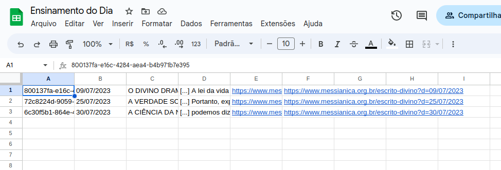

# Alexa - Ensinamento de Meishu-Sama

Alexa Skill que lê o Ensinamento de Meishu-Sama do Dia.

## Sobre o projeto

Skill de conversação para Alexa com objetivo de ler os ensinamento de Meishu-Sama de acordo com o site da [Igreja Mêssianica Mundial do Brasil](https://www.messianica.org.br/).

Esta Skill consome os dados de um google sheet, onde é armazenada os ensinamentos do dia que são postados no site da Igreja. Esse

    

## Tecnologias

Este projeto foi desenvolvido utilizando:

- [Alexa Developer Console](https://developer.amazon.com/)
- [Python](https://www.python.org/)
- [Scrapy](https://scrapy.org/)
- [ScrapeOps](https://scrapeops.io/)
- [Google Sheets](https://docs.gspread.org/en/latest/)
- [Poetry](https://python-poetry.org/)
- [AWS EC2](https://aws.amazon.com/pt/ec2/)

## Skill

A skill realiza a leitura do conteúdo que está no Google Sheets e retorna para o usuário o texto o ensinamento do dia a ser lido. O código está na pasta: [lambda](./lambda)

## Licença

Distribuído sob a licença MIT. Veja [`LICENSE`](./LICENSE) para mais informações.

## Autor

| [ @JVGC](https://github.com/JVGC) |
| :-----------------------------------------------------------------------------------------------------------------------: |
